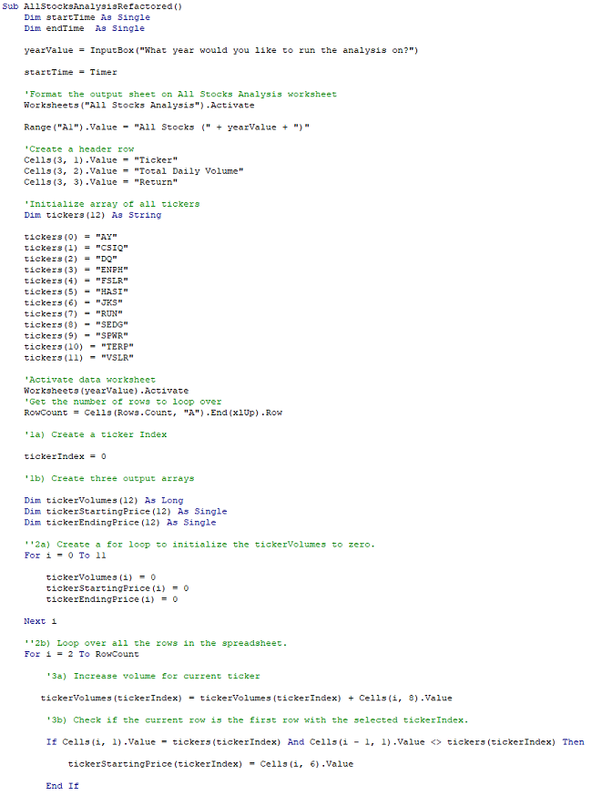
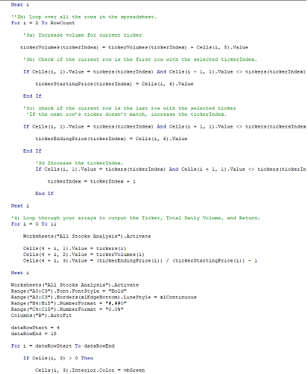
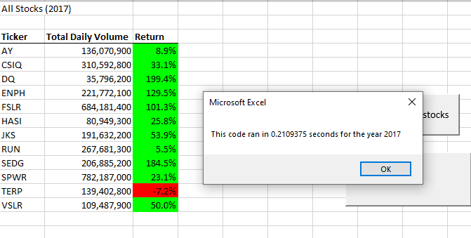
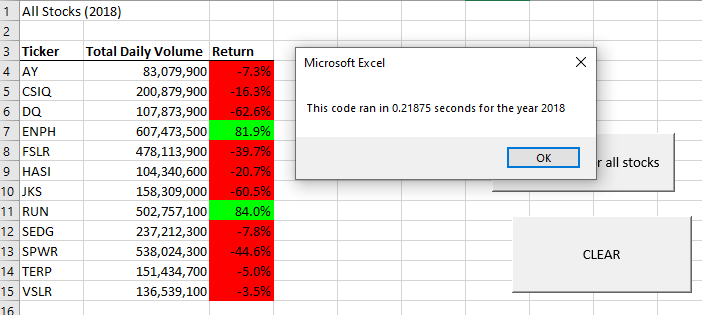

#  📈📉Stock Analysis 📈📉
## An depth analysis of stock performance and results of refactoring code. 

### **Project overview:** 
I was presented with a client named who sent stock datasets cover the years in 2017 and 2018. Initially our client was only interested in retrieving data from only one stock DAQO ("DQ").  Later, they requested to retrieve data regarding the entire stock market. The initial code that was composed was stable for the smaller dataset prior to the most recent request. My task now was to refactor or edit the solution code to loop throughout all the data more efficiently. 

## **Results**: 
I was successful in retrieving the requested information in that larger dataset presented to me. One the main edit to the refactored code it that I have removed the use of "nested loops”, nested loops can slow down the run of the code. As I have implemented a ticker index, and three additional arrays to outset the need for the nested loop from the original code.  used the following code below:

## **Stock Performance for 2017 & 2018**
- When comparing the performance between 2017 and 2018 stock market reports, the most striking element of the reports are the returns. The returns in 2017 greatly outperformed 2018 except for TERP and RUN stock. It is safe to the better return were in the 2017 for most of the stocks in the dataset.  
Below are the performance results along with the time elapsed stamp of the refactored code being ran also: 

## **Summary:** ##

1. There many advantages to refactoring a code. One main, advantages is gaining efficiency when working with larger dataset, I was able to decrease the processing time from my original code to my refactored code. **EVERY SECOND COUNTS!** Also refactoring helps us thinking outside the normal realms of VBA to figure out alternative options for task in the future. The disadvantage to refactoring is it can me more time consuming on the backend with the "trial and error" with the syntax error and investigating which line has the error and why. 

2. The pros and cons existed in my journey of refactoring the referenced code. Especially when it came to undoing the nested loop format. I was faced with multiple syntax errors where is could've something small like adding the closing quotation and me also re-writing the "If/Then" statements to make sure it was aligned with the code. I was able to achieve the decreased time with the refactoring which was one of the main objectives. 
